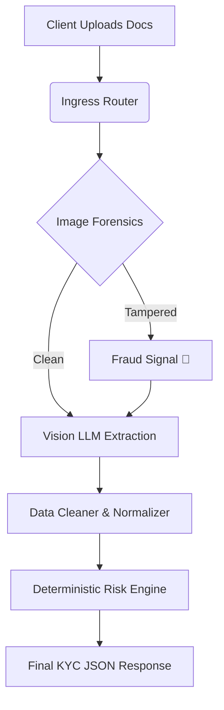
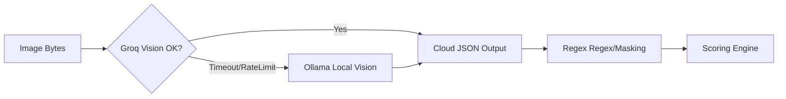
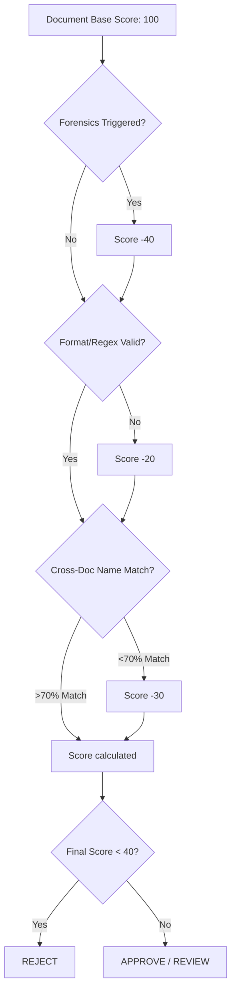

# AI-KYC-OCR
Offline-first, AI-driven KYC pipeline with physical forensics and deterministic validation.

## Problem Statement
Standard OCR pipelines trust pixels blindly. Fraudsters copy-paste names on PAN cards or photograph ID PDFs off a laptop screen, completely bypassing naive digitizers.
Also, relying purely on "smart AI" to validate documents causes hallucinations — models approve bad docs or invent missing data. Human manual review is too slow and expensive to scale.

## Solution Overview
Built a zero-trust KYC pipeline. 
We run 3-tier mathematical forensics on the image *before* the machine learning sees it. OCR is strictly used as a dumb extraction tool. Final validation and risk scoring are handled by 100% deterministic Python logic. If the cloud API goes down, the system seamlessly falls back to a local GPU/CPU model.

## System Architecture
Stateless Python microservice. 
- Fast ingress via FastAPI. 
- Mathematical fraud detection (OpenCV/Numpy). 
- Dual-engine OCR extraction (Cloud Groq -> Local Ollama). 
- Post-processing JSON normalizer.
- Strict math-based rules engine for final risk scoring.

## Tech Stack
- **API Framework**: FastAPI, Uvicorn (async/await)
- **Forensics / Math**: Pillow, OpenCV, Numpy
- **Primary AI**: Groq Cloud Vision (Llama-4-Scout)
- **Fallback AI**: Local Ollama (Llama-3.2-Vision)
- **Fuzzy Matching**: RapidFuzz
- **Networking**: HTTPX

## Data Flow
Image Upload -> Metadata Scan -> Compression Math -> FFT Moiré Check -> Cloud LLM OCR -> (Fallback Local LLM OCR) -> JSON Cleanup -> Field Normalization -> Cross-Doc Name/DOB Matching -> Rule Enforcement -> Official API Check (Optional) -> Final JSON Decision.

## Key Components
- `image_forensics.py`: Uses EXIF extraction, Error Level Analysis (ELA), and Fast Fourier Transforms (FFT) to mathematically prove if an image was tampered with or photographed off a screen.
- `main.py`: The orchestrator. Handles parallel processing, dual-LLM failover logic, error boundaries, and rate-limiting.
- `kyc_validator.py`: The brain. A deterministic rules engine. 100-point scoring system. Hard penalties for missing fields, bad regex, or forensics hits. Never relies on AI to make the final call.
- `sandbox_client.py`: Async integration wrapper for Sandbox.co.in government verification endpoints.

## Flowcharts

### Overall System Flow


### Data Pipeline & Failover


### Decision Logic


## Setup & Installation

Clone and install dependencies:
```bash
git clone https://github.com/patareshivraj/AI-KYC-OCR.git
cd AI-KYC-OCR
python -m venv venv
.\venv\Scripts\activate
pip install -r requirements.txt
```

Create `.env` file:
```env
GROQ_API_KEY=your_groq_key
OLLAMA_BASE_URL=http://localhost:11434
DEFAULT_PROVIDER=auto
API_KEY=your_secure_api_key
ALLOWED_ORIGINS=http://localhost:3000
```

Run the server:
```bash
uvicorn main:app --host 0.0.0.0 --port 8000 --reload
```

## How It Works (Walkthrough)
1. **Upload**: Client hits `/kyc/upload-and-check-all` with multipart forms containing PAN, Aadhaar, and Bank PDFs/images.
2. **Forensics Gate**: Before hitting any AI, `image_forensics.py` checks for Photoshop metadata, runs ELA to find pasted text blocks, and runs a 2D FFT to find monitor screen grids (Moiré). Fraud is instantly flagged.
3. **Extraction**: Images are base64 encoded and sent to Groq. If Groq is down or throttling, the `try/except` block instantly catches the HTTPX error and routes the payload to the local `Ollama` container running seamlessly on the server.
4. **Validation**: The raw JSON handles are cleaned up (dates normalized to `YYYY-MM-DD`, names upper-cased) and passed to `kyc_validator.py`.
5. **Scoring**: The validator subtracts points for missing data, format errors, or forensic triggers. It runs Levenshtein distance matching across all 3 documents. If the final score is > 70, it PASSES. If < 40, it FAILS.

## Results / Output

Sample successful payload containing a caught fraud attempt.
```json
{
  "status": "completed",
  "documents": {
    "pan": {
      "forensics": {
        "is_tampered": true,
        "reason": "FFT analysis indicates a photo of a screen (Moiré pattern detected)",
        "fft_high_freq_ratio": 83.69
      },
      "local_validation": {
        "is_valid": false,
        "score": 60,
        "issues": [
          "FFT analysis indicates a photo of a screen (Moiré pattern detected)"
        ],
        "summary": "weak"
      }
    }
  },
  "decision": {
    "verdict": "REVIEW",
    "average_document_score": 60,
    "message": "Manual review required. Signals: [PAN] FFT analysis indicates a photo of a screen..."
  }
}
```

## Limitations & Known Issues
- Currently parses Bank Statements only from the first 3 pages of a PDF to save tokens/memory.
- Very high-contrast, sharp printed documents may rarely trigger a false positive on the FFT threshold if lighting is harsh (currently tuned via `FORENSICS_MOIRE_RATIO` env var).
- Does not prevent malicious zip-bombs masked as PDFs. `fitz` loads streams directly to RAM.

## Future Improvements
- Move the OCR LLM blocking calls to a background queue (Celery/RQ) to allow thousands of concurrent uploads without holding HTTP connections open.
- Transition from regex-parsed ````json` blocks to native Structured Outputs API definitions once Groq Vision fully supports it natively.
- Apply a dynamic, matrix-based scaling factor to PDF ingress sizes to prevent memory overflow on extreme DPI uploads.
